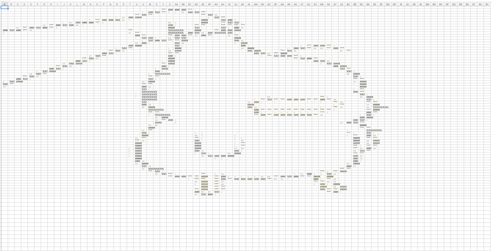

# ascii-to-excel
## 介绍
实现图片转ascii字符集并导入excel，涉及图像处理、像素处理、Excel处理
## 使用到的相关包
1. flag: flag 包是 Go 标准库中用于命令行参数解析的包。它允许你在程序中定义命令行参数，然后通过 flag.Parse() 解析用户在命令行中传递的参数。
2.  fmt: fmt 包提供了格式化输入输出的函数，例如 Println 用于打印信息到标准输出。
3.  github.com/fogleman/gg: gg 包是 Fogleman 编写的一个 2D 图形库，用于绘制图形和图像处理。
4.  github.com/nfnt/resize: resize 包提供了图像缩放的功能，用于调整图像的大小。
5.  github.com/xuri/excelize/v2: excelize 包是一个用于操作 Excel 文件的库，允许你创建、读取和修改 Excel 文件。
6.  os: os 包提供了一些与操作系统交互的功能，例如读取文件、处理路径等。
7.  path/filepath: path/filepath 包提供了处理文件路径的功能，例如构建绝对路径、提取文件名等。
8.  strconv: strconv 包提供了字符串与其他基本数据类型之间的相互转换功能。在这个程序中，可能用于将命令行参数中的字符串转换为数值。
9.  strings: strings 包提供了一些字符串处理的函数，例如分割字符串、判断字符串是否包含某子串等。
10.  sync: sync 包提供了并发编程中的同步原语，例如 WaitGroup 用于等待一组 goroutine 完成。 
## 功能流程
这个项目的功能是将输入文件夹中的图像文件转换为对应的 ASCII 艺术风格，并将结果保存为 Excel 文件。以下是项目的主要组成和功能：

1. **输入参数解析：**
    - 通过命令行参数指定 ASCII 字符权重数组、ASCII 字符集、输入文件夹地址、输出文件夹、Sheet 名称、重新调整后的图片大小、单元格列宽和行高等参数。

2. **图像处理：**
    - 遍历输入文件夹中的所有图片文件，判断文件是否为支持的图像格式（.png、.jpg、.jpeg）。
    - 打开图像文件并转换为灰度模式。
    - 对图像进行等比例缩小，使用 Lanczos3 算法。
    - 创建 Excel 文件，设置单元格列宽和行高。

3. **并行处理：**
    - 使用并行处理来加速图像处理过程，通过 `sync.WaitGroup` 等待所有 goroutine 完成任务。

4. **像素处理：**
    - 遍历图像的每个像素，获取亮度值。
    - 根据亮度值和预定义的 ASCII 字符权重数组，选择相应的 ASCII 字符，并根据权重重复字符。
    - 将生成的字符填充到对应的 Excel 单元格中，同时设置字符的颜色。

5. **Excel 文件保存：**
    - 将处理后的图像以 ASCII 艺术风格保存为 Excel 文件，文件名为原图像文件名加上"_ascii.xlsx"后缀。

6. **项目运行：**
    - 通过命令行输入参数，运行程序，处理输入文件夹中的所有图像文件，生成对应的 ASCII 艺术风格的 Excel 文件。

注意：由于上传的图片像素太大可能导致运行速度较慢，像素宽大小应不超过 26*26=676，以防止 Excel 列数过多。
## 运行步骤
1. 直接以默认参数运行（需要修改文件夹地址为自己的）
2. 命令行参数运行\
   go run ascii.go \
   -weights="13,8,5,3,2,1,0.5,0.2,0.1" \
   -asciiChars="@%#*+=-:." \
   -input="/Users/mumu/GolandProjects/ascii-to-excel/image" \
   -output="ascii_excel" \
   -sheet="Sheet1" \
   -scale=0.333 \
   -width=36 \
   -height=15

原图：\
\
运行效果如下：
